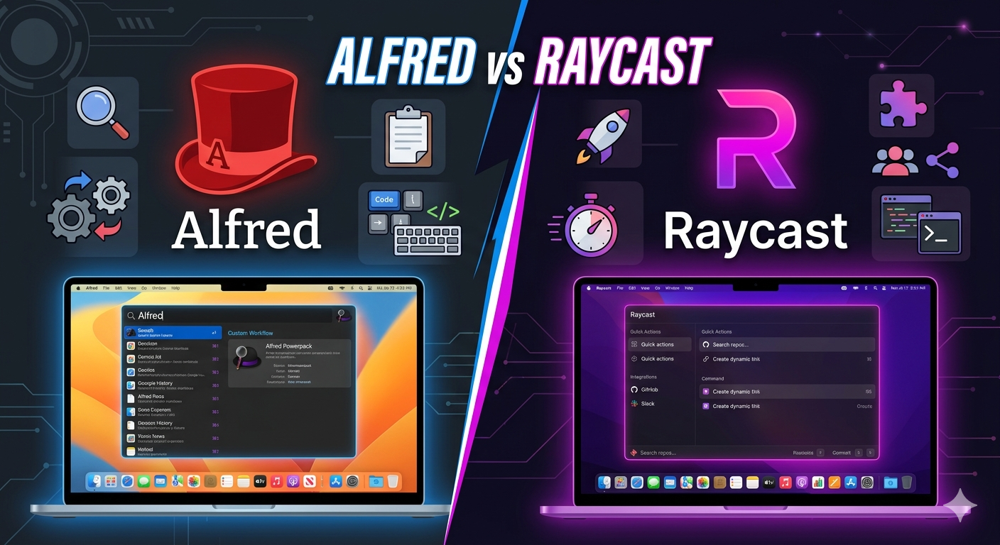

记录从 Alfred 转到 Raycast 的过程。

<!-- more -->

自己一直在使用 Alfred 作为快捷启动工具，替代系统原有的 Spotlight。对于我而言，免费版的 Alfred 凑活够用了。

我用到最多的功能是：

- 快速启动 App
- 计算器
- 浏览器书签搜索
- 快速浏览器搜索。比如可以输入 `g`+ 文本，快速打开浏览器，来搜索

Alfred 不能满足的地方：

- 不能在启动窗口发起 Obsidian 的搜索
- 设置不能同步

选择 Raycast 的理由：

1. 我以上用到的功能，Raycast 都有了。
2. 有专门的 Obsidian 插件，支持在窗口快速发起在 Obsidian 中的搜索
3. 设置可以同步。我直接导出对应配置文件，用坚果云同步即可。
4. 拥有窗口管理功能，这样我就可以卸载掉 Rectangle 小软件了。

不过，Raycast 的剪贴板功能，我没有用，还是喜欢 Maccy。建议大家按需配置插件，不需要追求多，自己够用就行。
