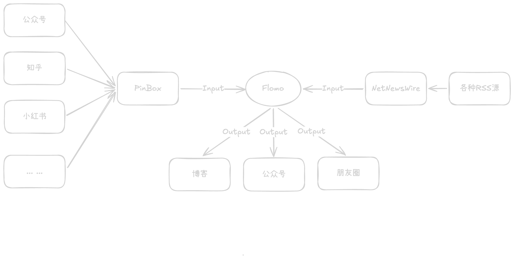
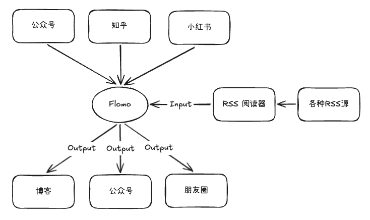

记录一下自己是如何处理每天海量的信息的。

<!-- more -->

## 引言

前几段时间受 Andrej Karpathy 大佬启发，决定好好梳理一下自己每天处理信息流的整个流程。

{.img1}

我用到的工具有：

- **PinBox**：一款专注于稍后阅读与内容收藏的工具，支持多平台同步和智能整理。
- **NetNewsWire**：开源、轻量且快速的 RSS 阅读器，适用于 macOS 和 iOS，主打简洁与高效。
- **Inoreader**：功能强大的在线 RSS 聚合器，支持自动化规则、全文搜索与跨设备同步。
- **Flomo**：轻量级碎片化笔记工具，支持微信输入、标签管理和知识沉淀。

这些工具间的关系如下图：

{.img1}

其中，PinBox 支持移动端、网页版，因此只要登录账号即可同步获取信息。

NetNewsWire 支持 iOS 端，不支持网页版。但是可以借助 Inoreader 来实现网页版同步信息。

Flomo: 支持移动端、网页端和 PC 端，用于记录散落在各个地方的碎片信息。
