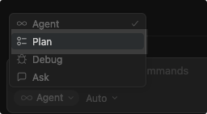
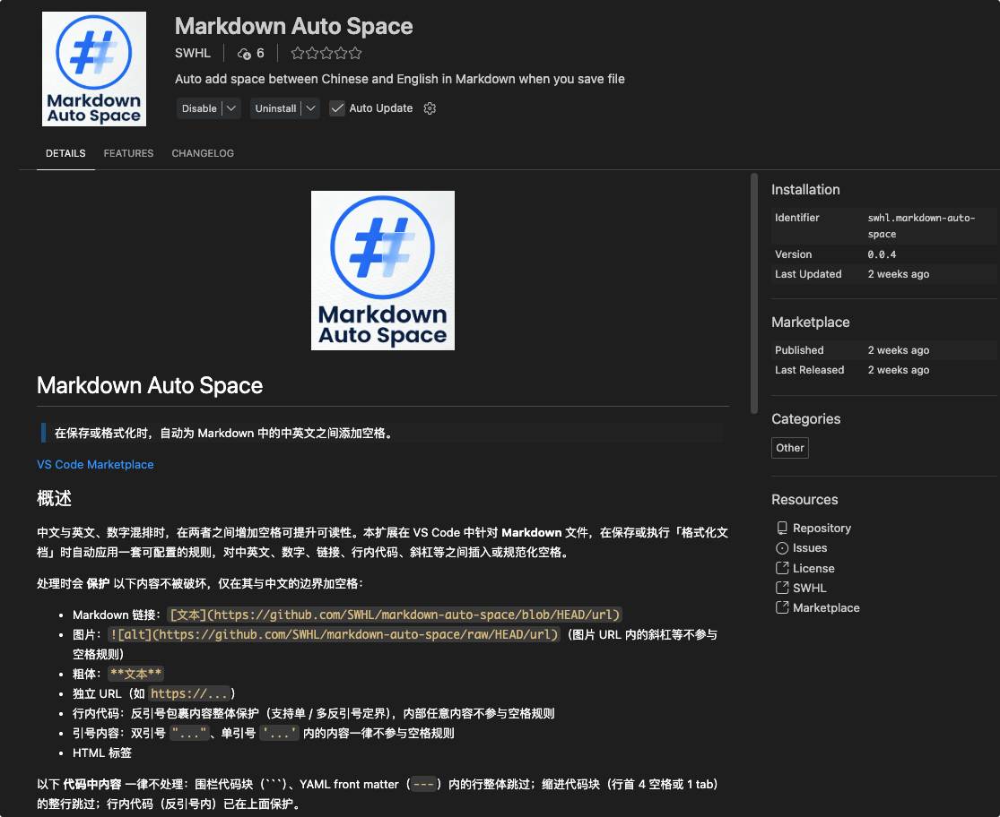

记录借助 Cursor 工具开发第一个 VSCode 插件的过程

<!-- more -->

## 起因

得益于编码大模型的发展，不会 TypeScript 的我也能做一些小东西来修补一下手头的工具链了。

在最近的阅读中，逐渐发现了一条排版规则：中英文混排时，英文左右建议留有空格，这样排版看着会舒服一些。

因此，我反观了先前我写的项目文档，发现中英混合下，英文单词左右都没有加空格。自从我知道这个排版规则后，这些文档看起来就有些紧凑了。

于是，我想：有没有工具可以批量添加空格？因为文档实在太多了，我这逐个手动来改，自然是太耗费体力了。

## 过程

我调研了现有的工具，发现了一个能实现类似功能的工具：[autocorrect](https://github.com/huacnlee/autocorrect)。

我仔细看了这个仓库，发现它做得相当全面。但是和我想的还是不太匹配。

我想做的是类似：[markdownlint](https://github.com/DavidAnson/markdownlint) 这个工具，支持开关某些规则，同时给出清晰地规则说明和提示。

虽然我并没有开发过 VS Code 插件，但是手上有 Cursor 这个“大杀器”。这使得这件事变得可行——我只需要明确自己的需求，让它去执行就行了。

在阅读了很多其他用户用 AI 模型写项目的经验分享后，我发现有一点共性：**要有测试来保证写的代码的正确**。

在 Cloudflare 的一名工程师在一周之内，借助 AI 模型从头重建了 Next.js （source: [How we rebuilt Next.js with AI in one week](https://blog.cloudflare.com/vinext/)）这件事中，成功的关键条件之一：**目前 API 已有良好文档和测试覆盖**。Next.js 拥有一个非常完善的测试体系。其仓库包含数千个端到端测试，覆盖几乎所有功能和边界情况。工程师直接移植了测试，提供了一份可以机械验证的说明书。

我是基于 [autocorrect](https://github.com/huacnlee/autocorrect) 这个项目来入手的。

之所以选择它，是因为它已经上架了 VS Code 插件市场，说明其整体架构是成熟可靠的。这样一来，我就省去了查阅 VS Code 插件开发文档的步骤。

随后，我 fork 该项目到本地，用 Cursor 打开，开启 Plan 模式。

接下来，就只需编写 Prompt 了——越详细越好。当然，这个过程并非一蹴而就。我在实际使用中不断发现新的潜在需求，逐步迭代完善。但最重要的是：**先做起来**。

项目名称是由千问生成候选，我来最终选定；Logo 则由豆包生成候选，同样由我决定。

我发现：**豆包在图像生成方面表现更优，而通义千问在回答问题和逻辑推理上更胜一筹**。

## 结果

最终成品：[markdown-auto-space](https://github.com/SWHL/markdown-auto-space)

主要特色：

- [x] 支持选中内容格式化
- [x] 支持 Web 端
- [x] 支持开关不同规则，同时对不同规则给出具体解释

大家直接在 VSCode 或者 Cursor 中 搜索：markdown-auto-space，安装即可使用。欢迎大家使用！
