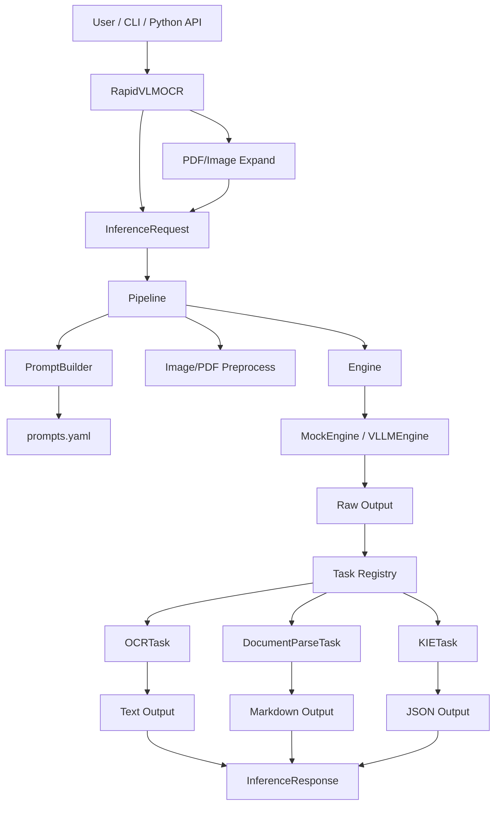

<!-- more -->

## 起源

原本设想的是复用 transformers 前后处理 + vllm 作为推理引擎来统一最近出现的 VLM OCR 大模型。

随着逐渐了解源码，发现 vllm 架构已经实现了我的设想。

它通过开放接口，让每个模型可以自定义自己的前后处理代码。vllm 启动时，只需按照规定去加载模型下的前后处理代码即可。

项目地址：https://github.com/RapidAI/RapidVLM-OCR

该项目目前已经归档了。

## 收获

- 想做事情前，一定要调研全面。如果我对 vllm 多做些了解，我就能更早知道它的架构，自然就不会想着搞这个框架。
- 系统的构建了整个项目的分层架构，一定意义上实现了高内聚与低耦合，具有易维护、易扩展的特点。
- 对工程化的代码有了更加深入的认识和思考。

## 主链路

```text
User Input
   |
   v
RapidVLMOCR
   |
   v
InferenceRequest
   |
   v
Pipeline
   |---- PromptBuilder
   |---- Image/PDF Preprocess
   |---- Engine
   |
   v
Task Postprocess
   |
   v
InferenceResponse
```

## 项目框架


