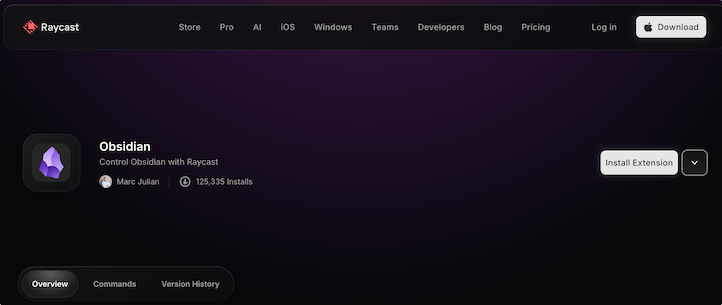
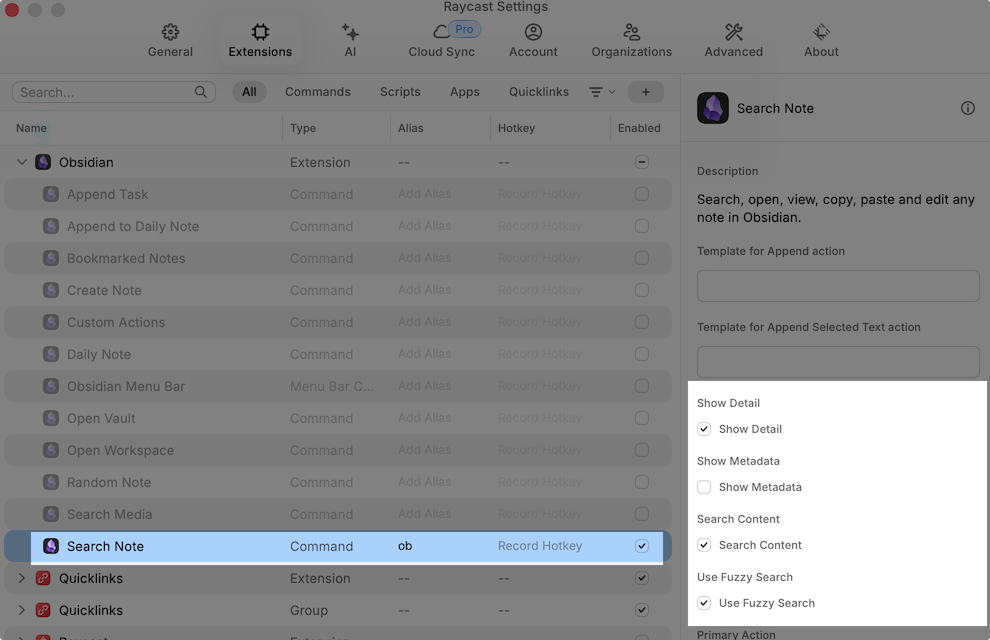
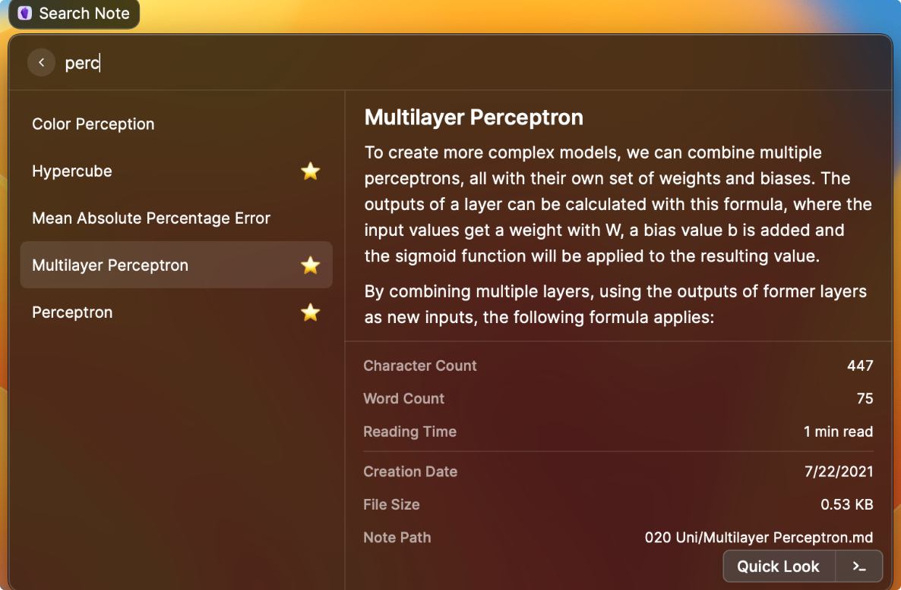

记录如何配置 Raycast 来快速其窗口中搜索 Obsidian 中的笔记。

<!-- more -->

<figure markdown="span">
  
  <figcaption> 配图来自 Google Gemini</figcaption>
</figure>

自己从 Alfred 转到 Raycast，很大一部分原因在于 Raycast 中支持 Obsidian 笔记的快速搜索。

经过一系列实践，先说结论：**部分功能支持，尚不完善，值得期待**。

## 配置和使用

Step 1：Raycast 安装 Obsidian 插件：[Obsidian](https://www.raycast.com/marcjulian/obsidian)。

Step 2: 按照下图来配置 Obsidian 插件。

Step 3: 开始使用。

## 不足之处

在开启了 **Search content** 后，Raycast 会自动定位到关键词所在 md 文件，并打开。但是不会自动跳转到关键词所在位置。

我搜索了全网，发现在 [obsidian-raycast](https://github.com/marcjulianschwarz/obsidian-raycast) 上有关于这个的讨论 （issue [#83](https://github.com/marcjulianschwarz/obsidian-raycast/issues/83)），但是已经好久不更新了。因此，我提了新的 issue：[#26396](https://github.com/raycast/extensions/issues/26396)。

敬请期待。
